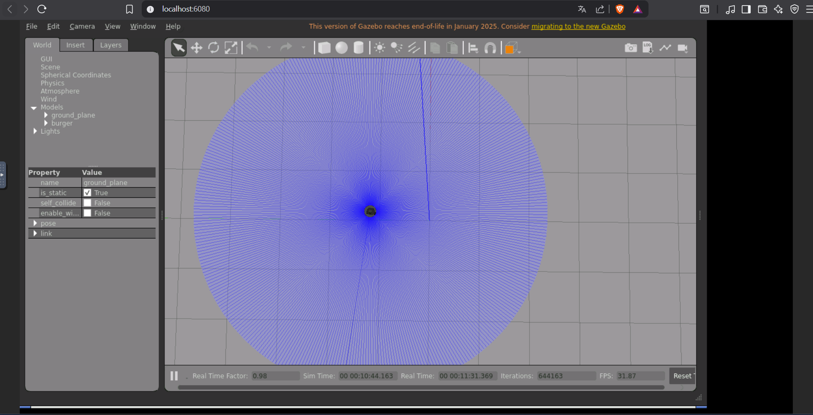
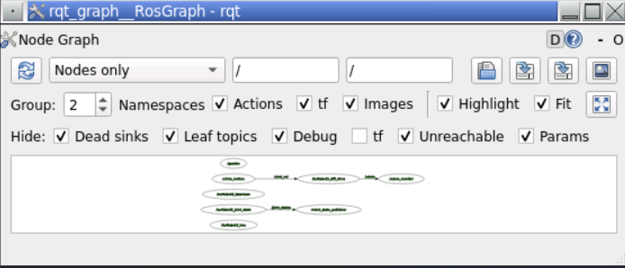

# Lecture 6: ROS2 Fundamentals - Topics, Nodes & Communication

**DevOps for Cyber-Physical Systems (FS 2026) — Übungsblatt 06**

- **Name:** Bill Brandon Chavez Arias
- **ROS2 Version:** ROS2 Humble 
- **Repository:** https://github.com/billbch/lecture6-ros2demo.git

---

## Aufgabe 1: Create ROS2 Package & Publisher-Subscriber Nodes

### (a) Package Creation & Circle Motion Publisher

#### Package Structure

```
/workspace/turtlebot3_ws/src/student_robotics
/workspace/turtlebot3_ws/src/student_robotics/package.xml
/workspace/turtlebot3_ws/src/student_robotics/resource
/workspace/turtlebot3_ws/src/student_robotics/resource/student_robotics
/workspace/turtlebot3_ws/src/student_robotics/setup.cfg
/workspace/turtlebot3_ws/src/student_robotics/setup.py
/workspace/turtlebot3_ws/src/student_robotics/student_robotics
/workspace/turtlebot3_ws/src/student_robotics/student_robotics/__init__.py
/workspace/turtlebot3_ws/src/student_robotics/student_robotics/circle_motion.py
/workspace/turtlebot3_ws/src/student_robotics/student_robotics/odom_monitor.py
/workspace/turtlebot3_ws/src/student_robotics/test
/workspace/turtlebot3_ws/src/student_robotics/test/test_copyright.py
/workspace/turtlebot3_ws/src/student_robotics/test/test_flake8.py
/workspace/turtlebot3_ws/src/student_robotics/test/test_pep257.py
```

#### Python code: `circle_motion.py`

```python
import rclpy
from rclpy.node import Node
from geometry_msgs.msg import Twist

class CircleMotion(Node):
    def __init__(self):
        super().__init__('circle_motion')
        self.publisher_ = self.create_publisher(Twist, '/cmd_vel', 10)
        self.timer = self.create_timer(0.1, self.timer_callback)  # 10 Hz
        self.get_logger().info('CircleMotion node started!')

    def timer_callback(self):
        msg = Twist()
        msg.linear.x = 0.3   # 0.3 m/s forward
        msg.angular.z = 0.5  # 0.5 rad/s rotation
        self.publisher_.publish(msg)

def main(args=None):
    rclpy.init(args=args)
    node = CircleMotion()
    rclpy.spin(node)
    node.destroy_node()
    rclpy.shutdown()

if __name__ == '__main__':
    main()
```

#### Screenshot: Robot moving in circles in Gazebo



> TurtleBot3 Burger making circular motions in Gazebo Classic. The blue trace shows the robot's path: linear velocity 0.3 m/s, angular velocity 0.5 rad/s at 10 Hz.

#### Why use `create_timer()`? 

`create_timer()` allows publishing messages at a fixed frequency (10 Hz) in a non-blocking way, integrating cleanly with ROS2's executor loop. This ensures the node remains responsive to other events (like shutdown signals) while still publishing velocity commands periodically.

---

### (b) Odometry Subscriber

#### Python code: `odom_monitor.py`

```python
import rclpy
from rclpy.node import Node
from nav_msgs.msg import Odometry

class OdomMonitor(Node):
    def __init__(self):
        super().__init__('odom_monitor')
        self.subscription = self.create_subscription(
            Odometry,
            '/odom',
            self.odom_callback,
            10)
        self.get_logger().info('OdomMonitor node started!')

    def odom_callback(self, msg):
        x = msg.pose.pose.position.x
        y = msg.pose.pose.position.y
        linear_x = msg.twist.twist.linear.x
        angular_z = msg.twist.twist.angular.z
        self.get_logger().info(
            f'Position -> x: {x:.3f}, y: {y:.3f} | '
            f'Velocity -> linear.x: {linear_x:.3f}, angular.z: {angular_z:.3f}'
        )

def main(args=None):
    rclpy.init(args=args)
    node = OdomMonitor()
    rclpy.spin(node)
    node.destroy_node()
    rclpy.shutdown()

if __name__ == '__main__':
    main()
```

#### Terminal output: Both nodes running

```
[INFO] [1775169316.545417437] [circle_motion]: CircleMotion node started!
```

```
[INFO] [1775169835.042652228] [odom_monitor]: Position -> x: 0.404, y: 1.069 | Velocity -> linear.x: 0.299, angular.z: 0.507
[INFO] [1775169835.078317755] [odom_monitor]: Position -> x: 0.395, y: 1.074 | Velocity -> linear.x: 0.299, angular.z: 0.508
[INFO] [1775169835.110322673] [odom_monitor]: Position -> x: 0.387, y: 1.080 | Velocity -> linear.x: 0.299, angular.z: 0.504
[INFO] [1775169835.142580491] [odom_monitor]: Position -> x: 0.378, y: 1.086 | Velocity -> linear.x: 0.299, angular.z: 0.503
[INFO] [1775169835.176054501] [odom_monitor]: Position -> x: 0.370, y: 1.091 | Velocity -> linear.x: 0.299, angular.z: 0.499
```

#### Terminal output: `ros2 node list` showing both nodes

```
/circle_motion
/gazebo
/odom_monitor
/robot_state_publisher
/robot_state_publisher
/turtlebot3_diff_drive
/turtlebot3_imu
/turtlebot3_joint_state
/turtlebot3_laserscan
```

#### How does pub-sub decoupling work?

In the publisher-subscriber pattern, nodes communicate exclusively through named topics without any direct knowledge of each other. The `circle_motion` publisher sends `Twist` messages to `/cmd_vel` without knowing who is listening, and `odom_monitor` receives `/odom` messages without knowing who published them. This decoupling means nodes can be started, stopped, or replaced independently — for example, stopping `circle_motion` does not crash `odom_monitor`, which will simply stop receiving new messages but continues running normally.

---

## Aufgabe 2: ROS2 Topic Inspection & Message Frequency Analysis

### (a) ROS2 CLI Topic Commands

#### `ros2 topic list` — All active topics

```
/clock
/cmd_vel
/imu
/joint_states
/odom
/parameter_events
/performance_metrics
/robot_description
/rosout
/scan
/tf
/tf_static
```

#### `ros2 topic info /cmd_vel` — Publishers and subscribers

```
Type: geometry_msgs/msg/Twist
Publisher count: 1
Subscription count: 1
```

**`/cmd_vel` has 1 publisher (`circle_motion`) and 1 subscriber (`turtlebot3_diff_drive`).**

#### `ros2 topic info /odom`

```
Type: nav_msgs/msg/Odometry
Publisher count: 1
Subscription count: 1
```

#### `ros2 topic hz /odom` — Message frequency

```
average rate: 27.471
average rate: 28.063
average rate: 28.313
average rate: 28.305
average rate: 28.351
average rate: 28.381
average rate: 28.343
average rate: 28.204
```

#### `ros2 topic bw /odom` — Bandwidth

```
Subscribed to [/odom]
21.07 KB/s from 29 messages
    Message size mean: 0.72 KB min: 0.72 KB max: 0.72 KB
21.03 KB/s from 58 messages
    Message size mean: 0.72 KB min: 0.72 KB max: 0.72 KB
20.78 KB/s from 86 messages
    Message size mean: 0.72 KB min: 0.72 KB max: 0.72 KB
```

#### `ros2 node info /circle_motion`

```
/circle_motion
  Subscribers:
    (none)
  Publishers:
    /cmd_vel: geometry_msgs/msg/Twist
    /parameter_events: rcl_interfaces/msg/ParameterEvent
    /rosout: rcl_interfaces/msg/Log
  Service Servers:
    /circle_motion/describe_parameters
    /circle_motion/get_parameter_types
    /circle_motion/get_parameters
    /circle_motion/list_parameters
    /circle_motion/set_parameters
    /circle_motion/set_parameters_atomically
```

#### Answer: What is `/odom` frequency? Why does it matter?

The `/odom` topic publishes at approximately **28 Hz**. Frequency matters for robot control because the controller needs frequent position updates to make accurate corrections — a low frequency would cause the robot to react slowly to changes and accumulate positioning errors. For a TurtleBot3 moving at 0.3 m/s, 28 Hz means a position update roughly every 35ms, which is sufficient for smooth circular motion control.

#### Answer: How many publishers/subscribers does `/cmd_vel` have?

- **Publishers: 1** → `/circle_motion` (our node publishing Twist commands)
- **Subscribers: 1** → `/turtlebot3_diff_drive` (Gazebo plugin controlling the robot wheels)

#### Answer: Difference between `ros2 topic hz` and `ros2 topic bw`?

`ros2 topic hz` measures the **publishing frequency** in messages per second, showing how often new messages arrive on a topic. `ros2 topic bw` measures the **bandwidth** in bytes per second, showing how much data is being transferred — useful for identifying network bottlenecks or unexpectedly large message payloads.

---

### (b) Visualize Communication Graph

#### Screenshot: rqt_graph



#### What does the graph show?

The rqt_graph shows the active ROS2 nodes as ovals connected by topic edges. The `/circle_motion` node connects to `/turtlebot3_diff_drive` via the `/cmd_vel` topic, and `/turtlebot3_diff_drive` connects to `/odom_monitor` via the `/odom` topic. This visually confirms the publisher-subscriber chain: our node controls the robot, and the robot's odometry feeds back to our subscriber.

#### What happens if you stop `circle_motion`? Does `odom_monitor` still work?

If `circle_motion` is stopped, `odom_monitor` **continues running** because it only depends on the `/odom` topic being published — which comes from the TurtleBot3 simulation plugin, not from `circle_motion`. The robot will stop moving (no more velocity commands), but the odometry subscriber will keep printing position data (all zeros for velocity, static position).

---

## Commands Used

```bash
# Create package
ros2 pkg create --build-type ament_python student_robotics

# Build
cd /workspace/turtlebot3_ws
colcon build --packages-select student_robotics
source install/setup.bash

# Launch simulation
tb3_empty

# Run nodes
ros2 run student_robotics circle_motion
ros2 run student_robotics odom_monitor

# Inspection commands
ros2 topic list
ros2 topic info /cmd_vel
ros2 topic info /odom
ros2 topic hz /odom
ros2 topic bw /odom
ros2 node list
ros2 node info /circle_motion
rqt_graph
```

## Issues Encountered

- `tree` command not available in container → used `find` as alternative
- Package directory already existed from previous attempt → reused existing files
- Gazebo GUI accessed via browser at `http://localhost:6080` (noVNC) since running inside Docker Dev Container on Windows
